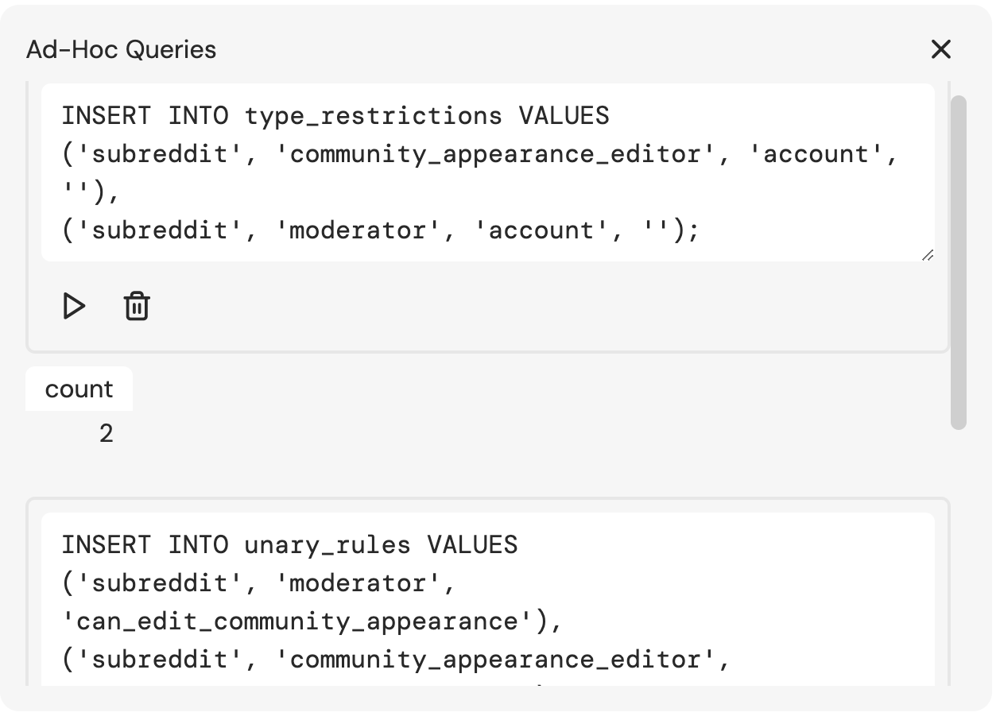

# feldera-rebac
A simple example of converting a ReBAC schema into static rules that derive relationship subgraphs.

## Example
1. Start Feldera
```
docker run -p 8080:8080 --tty --rm -it ghcr.io/feldera/pipeline-manager:0.33.0
```

2. Create a Feldera Pipeline called `rebac`
```
curl -L 'http://localhost:8080/v0/pipelines' \
-H 'Content-Type: application/json' \
-H 'Accept: application/json' \
-d '{
  "description": "A Feldera sample that demonstrates ReBAC models.",
  "name": "rebac",
  "program_code": ""
}'
```


3. Create the necessary tables and views for the relationship graph SQL program.

Copy the SQL program.
```
cat program.sql | pbcopy
```

Navigate to http://localhost:8080/pipelines/rebac/ and paste the SQL program into the `program.sql` file.


4. Start the Feldera Pipeline by hitting the "Start" button

5. Run the rules generator.
The `schema.json` file contains a sample schema definition for a ReBAC model. We convert this schema definition into data that defines the rules for how the relationship subgraphs should be derived.

```
go run main.go rules.go
```

This will output:

```
INSERT INTO type_restrictions VALUES
('subreddit', 'community_appearance_editor', 'account', ''),
('subreddit', 'moderator', 'account', '');

INSERT INTO unary_rules VALUES
('subreddit', 'moderator', 'can_edit_community_appearance'),
('subreddit', 'community_appearance_editor', 'can_edit_community_appearance');
```

6. Copy the `INSERT` statements from step 5 into the "Ad-Hoc Queries" window in the Pipeline dashboard, and run them.



7. Insert some relationships
```
INSERT INTO relationships VALUES
  ('account', 'u/crazycarl', '', 'subreddit', 'r/dogs', 'moderator'),
  ('account', 'u/otherdude', '', 'subreddit', 'r/dogs', 'community_appearance_editor'),
  ('other', 'someid', '', 'subreddit', 'r/cats', 'moderator');
```

8. Check the status of the relationship graph by querying the `dervied_relationships` table.
```
SELECT * FROM derived_relationships;
```

| subject_type | subject_id  | subject_relation | resource_type | resource_id | relationship                  |
|--------------|-------------|------------------|---------------|-------------|-------------------------------|
| account      | u/crazycarl | ''               | subreddit     | r/dogs      | moderator                     |
| account      | u/crazycarl | ''               | subreddit     | r/dogs      | can_edit_community_appearance |
| account      | u/otherdude | ''               | subreddit     | r/dogs      | community_appearance_editor   |
| account      | u/otherdude | ''               | subreddit     | r/dogs      | can_edit_community_appearance |

> ℹ️ Notice that the relationship `('other', 'someid', '', 'subreddit', 'r/cats', 'moderator')` didn't produce any results in the dervied relationship graph.
>
> This is because the type restrictions of the model did not permit so, which shows that we respect the type restrictions of the model in addition to the derived rules of the model.

## Coming Soon..
* Support for intersection rules `viewer(subject, object), allowed(subject, object) :- can_view(subject, object)`
* Support for negated rules `viewer(subject, object), !restricted(subject, object) :- can_view(subject, object)`
* Support for bidirectional rules `blocks(subject, object) :- blocked_by(object, subject)`
* Support for composite relationship definitions of the form `can_view = (viewer or editor) but not restricted`. This will include  support for nested expressions with arbitrary parenthetical groupings. To do this we will need "composite terms", or terms in the rules that refer to a compound definition.

## Limitations
* Support has not yet been added to composite/compound permission definitions, see the [Coming Soon..](#coming-soon) mentioned above. This means that models like the one shown below are not supported. 

  Work needs to be done to convert an n-ary permission expression tree into a binary permission expression tree. To do that we will need to introduce some intermediate or composite terms in the unary and binary rules tables. This is similar to a sort of hub/spoke style model where the hub is the composite term and the spokes are the individual operands of the composite definition. In this example the composite permission `can_view` is composed of two hubs `(viewer or editor)` (let's call this `__viewer_or_editor__`) and the other hub `(__viewer_or_editor__) and allowed` (let's call this `__viewer_or_editor__and__allowed__`).
  
  The composite rule for `can_view` can be rewritten as the composition of the two hub terms, namely `(__viewer_or_editor__and__allowed__ but not restricted)`
```
typedef user {}

typedef document {
  relation viewer: [user]
  relation restricted: [user]
  relation editor: [user]
  relation allowed: [user]

  permission can_view = ((viewer or editor) and allowed) but not restricted
}
```

* There currently isn't a bound to the recursion depth, so if certain relationships would cause infinite recursion then Feldera will 💥. There is an [open issue](https://github.com/feldera/feldera/issues/3318) to add a recursion depth limit for recursive SQL queries in Feldera.