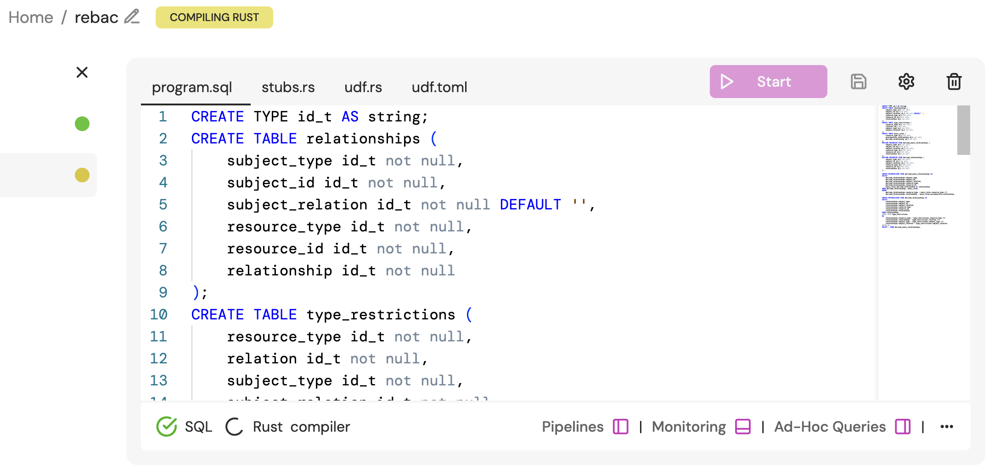

# Hierarchical Relationships
This example demonstrates how we can model hierarchical relationships. If you are familiar with [Google Zanzibar](https://storage.googleapis.com/gweb-research2023-media/pubtools/5068.pdf), hierarchical relationships are referred to as tuple-to-userset. If involves a lookup on some base relation (the tupleset in Zanzibar terms) and resolves a target relation on the result of the object found from the base relation.

The example [schema.json](./schema.json) represents the following declarative relationship model:
```
typedef user {}

typedef folder {
    relation parent: [folder]
    relation viewer: [user]

    permission can_view = viewer or can_view on parent
}

typedef document {

    relation parent: [folder]

    // anyone who 'can_view' the parent folder 'can_view' the document
    permission can_view = can_view on parent
}
```

## Try It Out
> ℹ️ The commands assume you are running from the root path of this repository.

1. Start Feldera
```
docker run -p 8080:8080 --tty --rm -it ghcr.io/feldera/pipeline-manager:0.33.0
```

2. Create a Feldera Pipeline called `rebac`
```
curl -L 'http://localhost:8080/v0/pipelines' \
-H 'Content-Type: application/json' \
-H 'Accept: application/json' \
-d '{
  "description": "A Feldera sample that demonstrates ReBAC models.",
  "name": "rebac",
  "program_code": ""
}'
```

3. Create the necessary tables and views for the relationship graph SQL program.

Copy the SQL program.
```
cat program.sql | pbcopy
```

Navigate to http://localhost:8080/pipelines/rebac/ and paste the SQL program into the `program.sql` file.


4. Start the Feldera Pipeline by hitting the "Start" button

5. Run the rules generator.
The `schema.json` file contains a sample schema definition for a ReBAC model. We convert this schema definition into data that defines the rules for how the relationship subgraphs should be derived.

```
go run main.go rules.go --schema-path ./examples/hierarchical-relationships/schema.json
```

This will output:

```
INSERT INTO type_restrictions VALUES
('folder', 'parent', 'folder', ''),
('folder', 'viewer', 'user', ''),
('document', 'parent', 'folder', '');

INSERT INTO unary_rules VALUES
('folder', 'viewer', 'can_view');

INSERT INTO binary_rules VALUES
('folder', 'can_view', 'folder', 'parent', 'can_view'),
('folder', 'can_view', 'document', 'parent', 'can_view');
```

6. Copy the `INSERT` statements from step 5 into the "Ad-Hoc Queries" window in the Feldera Pipeline dashboard, and run them.

7. Insert some relationships
```
INSERT INTO relationships VALUES
    ('user', 'jon', '', 'folder', 'x', 'viewer'),
    ('folder', 'x', '', 'folder', 'y', 'parent'),
    ('folder', 'y', '', 'folder', 'z', 'parent'),
    ('folder', 'z', '', 'document', 'readme', 'parent');
```

8. Check the status of the relationship graph by querying the `dervied_relationships` table.
```
SELECT * FROM derived_relationships;
```

| subject_type | subject_id | subject_relation | resource_type | resource_id | relationship |
|:------------:|:----------:|:----------------:|:-------------:|:-----------:|:------------:|
| user         | jon        | ''               | folder        | x           | viewer       |
| user         | jon        | ''               | document      | readme      | can_view     |
| user         | jon        | ''               | folder        | x           | can_view     |
| folder       | y          | ''               | folder        | z           | parent       |
| folder       | z          | ''               | document      | readme      | parent       |
| user         | jon        | ''               | folder        | y           | can_view     |
| user         | jon        | ''               | folder        | z           | can_view     |
| folder       | x          | ''               | folder        | y           | parent       |

> ℹ️ Notice that `user:jon` can_view the `document:readme`, and that comes from the multi-level parent folder hierarchy. `folder:x` is the parent of `folder:y`, `folder:y` is the parent of `folder:z`, and `folder:z` is the parent of `document:readme`. Since `user:jon` can view the top-most folder in the hierarchy (folder:x) he can view every resource involved in that hiearchy, and the materialized view reflects that relationship graph.