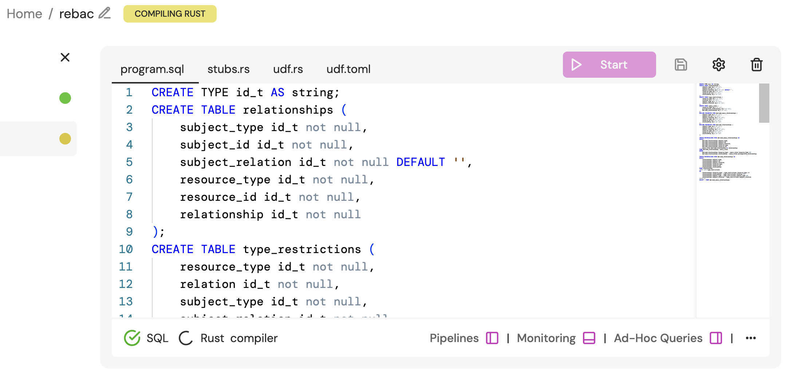
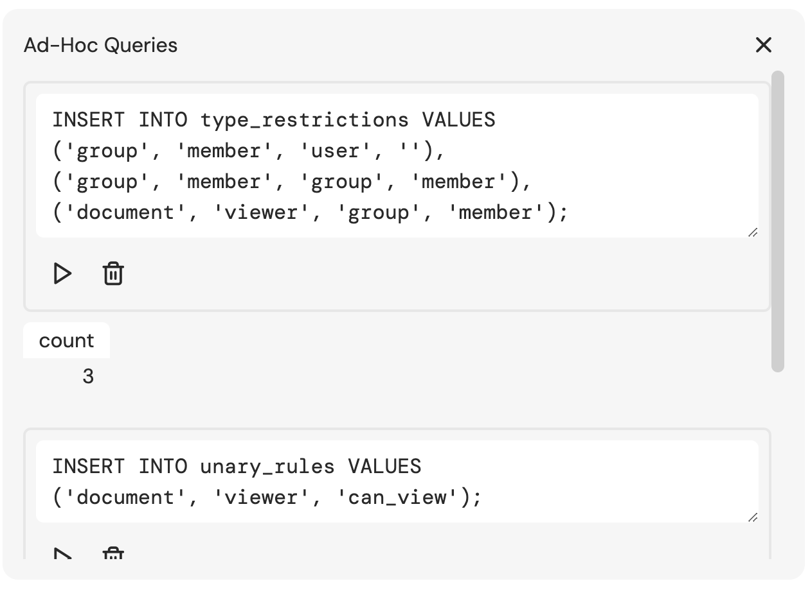

# Nested Groups (Groups of Groups)
This example demonstrates how we can model nested relationships (e.g. groups of groups). If you are familiar with [Google Zanzibar](https://storage.googleapis.com/gweb-research2023-media/pubtools/5068.pdf), nested groups are referred to as usersets.

The example [schema.json](./schema.json) represents the following declarative relationship model:
```
typedef user {}

typedef group {
    // e.g. groups can be nested in other groups, and users can be part of groups
    relation member: [user, group#member]
}

typedef document {

    // any member of a group can be a viewer of a document
    relation viewer: [group#member]

    // anyone who is a viewer 'can_view' the document
    permission can_view = viewer
}
```

## Try It Out
> ℹ️ The commands assume you are running from the root path of this repository.

1. Start Feldera
```
docker run -p 8080:8080 --tty --rm -it ghcr.io/feldera/pipeline-manager:0.33.0
```

2. Create a Feldera Pipeline called `rebac`
```
curl -L 'http://localhost:8080/v0/pipelines' \
-H 'Content-Type: application/json' \
-H 'Accept: application/json' \
-d '{
  "description": "A Feldera sample that demonstrates ReBAC models.",
  "name": "rebac",
  "program_code": ""
}'
```


3. Create the necessary tables and views for the relationship graph SQL program.

Copy the SQL program.
```
cat program.sql | pbcopy
```

Navigate to http://localhost:8080/pipelines/rebac/ and paste the SQL program into the `program.sql` file.


4. Start the Feldera Pipeline by hitting the "Start" button

5. Run the rules generator.
The `schema.json` file contains a sample schema definition for a ReBAC model. We convert this schema definition into data that defines the rules for how the relationship subgraphs should be derived.

```
go run main.go rules.go --schema-path ./examples/nested-groups/schema.json
```

This will output:

```
INSERT INTO type_restrictions VALUES
('group', 'member', 'user', ''),
('group', 'member', 'group', 'member'),
('document', 'viewer', 'group', 'member');

INSERT INTO unary_rules VALUES
('document', 'viewer', 'can_view');
```

6. Copy the `INSERT` statements from step 5 into the "Ad-Hoc Queries" window in the Feldera Pipeline dashboard, and run them.



7. Insert some relationships
```
INSERT INTO relationships VALUES
  ('user', 'jon', '', 'group', 'iam', 'member'),
  ('user', 'jill', '', 'group', 'devx', 'member'),
  ('group', 'iam', 'member', 'group', 'eng', 'member'),
  ('group', 'devx', 'member', 'group', 'eng', 'member'),
  ('group', 'eng', 'member', 'document', 'readme', 'viewer');
```

8. Check the status of the relationship graph by querying the `dervied_relationships` table.
```
SELECT * FROM derived_relationships;
```

| subject_type | subject_id | subject_relation | resource_type | resource_id | relationship |
|--------------|------------|------------------|---------------|-------------|--------------|
| user         | jon        | ''               | document      | readme      | can_view     |
| group        | devx       | member           | document      | readme      | viewer       |
| user         | jon        | ''               | group         | eng         | member       |
| group        | devx       | member           | group         | eng         | member       |
| group        | eng        | member           | document      | readme      | can_view     |
| group        | devx       | member           | document      | readme      | can_view     |
| group        | eng        | member           | document      | readme      | viewer       |
| user         | jill       | ''               | group         | devx        | member       |
| user         | jon        | ''               | document      | readme      | viewer       |
| user         | jill       | ''               | document      | readme      | can_view     |
| user         | jill       | ''               | document      | readme      | viewer       |
| group        | iam        | member           | group         | eng         | member       |
| user         | jill       | ''               | group         | eng         | member       |
| group        | iam        | member           | document      | readme      | viewer       |
| group        | iam        | member           | document      | readme      | can_view     |
| user         | jon        | ''               | group         | iam         | member       |

> ℹ️ Notice that every nested group relationship is expanded such that `user:jon` and `user:jill`, who are members of sub-groups `group:iam` and `group:dev` of the engineering group `group:eng`, are also viewers of the `document:readme` and therefore `can_view` the readme document.